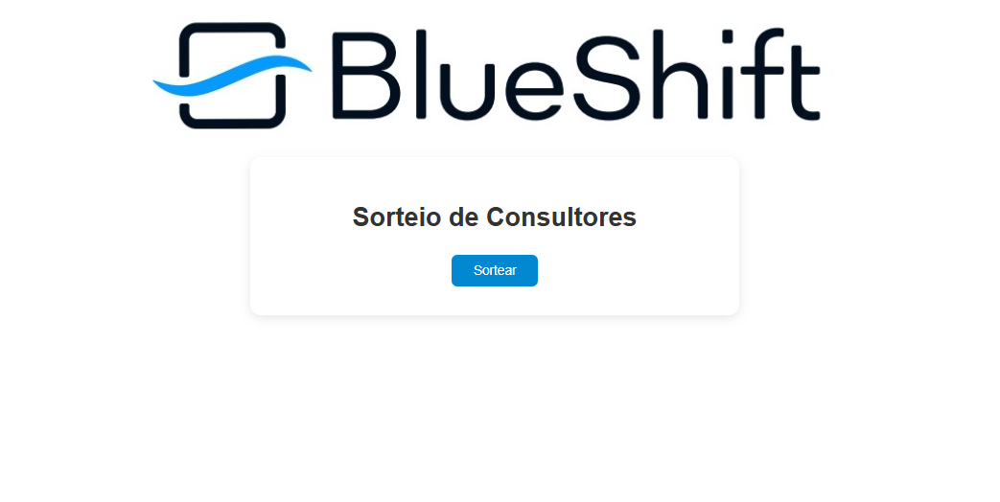
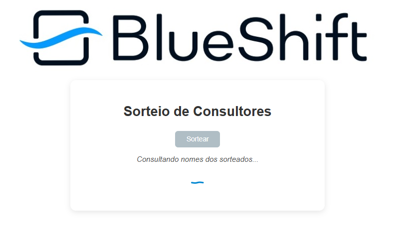
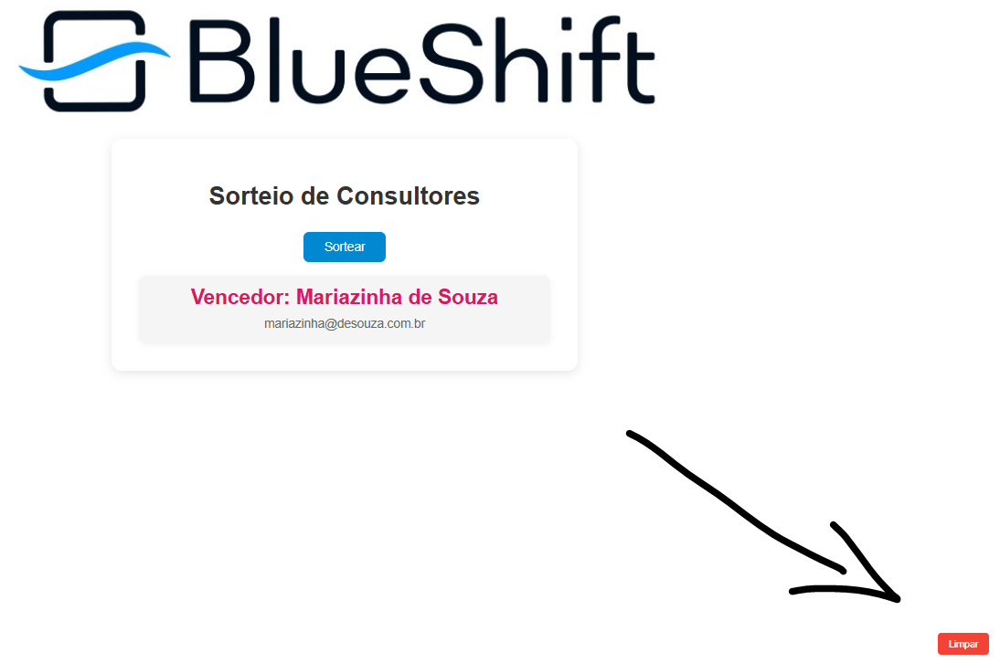

cd into root folder:

cd command
```
cd <path-to-folder>/sorteador-blueshift
```

Run the app.py:

```shell
python app.py
```

Expected output:
```txt
 * Serving Flask app 'app'
 * Debug mode: on
WARNING: This is a development server. Do not use it in a production deployment. Use a production WSGI server instead.
 * Running on http://127.0.0.1:5000
Press CTRL+C to quit
 * Restarting with watchdog (windowsapi)
 * Debugger is active!
 * Debugger PIN: 617-277-318
127.0.0.1 - - [04/Apr/2025 17:43:27] "GET / HTTP/1.1" 200 -
127.0.0.1 - - [04/Apr/2025 17:43:27] "GET /static/style.css?v=1.0 HTTP/1.1" 304 -
127.0.0.1 - - [04/Apr/2025 17:43:28] "GET /static/logo.jpg HTTP/1.1" 304 -
```

open in browser:
```html
http://localhost:5000
```

### Browser:


### Click in the "sortear" button to get a winner from the csv file:


### After a few funny words the winner is presented:


### click in the "limpar" button to clean the name and sorte another one




# Notes:
- Names will not be repeated when you click in the clean button. To reestart sorting names using full csv, re-run the python script.

- Update the csv 'consultores.csv' with your own list.